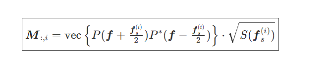

完整公式推导：从部分相干到无 TCC

这一版我帮你**从头到尾彻底整理**：

1）Hopkins 部分相干成像 → SOCS 分解 → 工业无TCC 模式矩阵法的完整公式推导全流程（物理+离散+工程实现）

2）1024×2048 可微 PyTorch 代码中所有参数、模块的详细含义

3）无TCC 为什么数学等价、工程上可行的核心证明

完全对齐你最终使用的：非正方形 1024×2048、可自动微分、GPU 加速、空域核裁剪版本。

---
0. 符号约定（全文统一）

- 空域坐标：$\boldsymbol{r}=(x,y)$，单位 nm

- 频域坐标：$\boldsymbol{f}=(f_x,f_y)$，单位 1/nm

- 掩模：$t(\boldsymbol{r})$（复振幅，透射率）

- 光瞳：$P(\boldsymbol{f})$（含像差的复光瞳）

- 光源：$S(\boldsymbol{f}_s)$（非相干光源角谱/有效光源）

- 系统截止频率：$f_c=\dfrac{\text{NA}}{\lambda}$

- 网格：高度 $H=1024$，宽度 $W=2048$，采样步长 $\Delta x$（空域）

- 离散频域：$f_x[i,j],\ f_y[i,j]$，对应像素 $(i,j)$

---
一、完整公式推导：从部分相干 → Hopkins → SOCS → 无TCC

1.1 相干成像（单个平面波照明）

照明波矢为 $\boldsymbol{f}_s$（对应光源上一个点），则相干成像场为：

$$

U_{\boldsymbol{f}_s}(\boldsymbol{r})

= \mathcal{F}^{-1}\left\{

\tilde{t}(\boldsymbol{f})\cdot P\left(\boldsymbol{f}+\tfrac{\boldsymbol{f}_s}{2}\right)\cdot P^*\left(\boldsymbol{f}-\tfrac{\boldsymbol{f}_s}{2}\right)

\right\}

$$

强度：

$$

I_{\boldsymbol{f}_s}(\boldsymbol{r}) = |U_{\boldsymbol{f}_s}(\boldsymbol{r})|^2

$$

物理意义：光源点 $\boldsymbol{f}_s$ 等效于让光瞳做 双向偏移 $P(\boldsymbol{f}\pm\boldsymbol{f}_s/2)$。

1.2 部分相干成像（强度直接叠加，非相干光源）

部分相干 = 大量独立相干点源强度相加（非相干，不加场）：

$$

I(\boldsymbol{r}) = \int S(\boldsymbol{f}_s)\; \big|U_{\boldsymbol{f}_s}(\boldsymbol{r})\big|^2 d\boldsymbol{f}_s

$$

代入相干场：

$$

I(\boldsymbol{r})

= \iint S(\boldsymbol{f}_s)\;

\underbrace{

\left[

\mathcal{F}^{-1}\left\{\tilde{t}(\boldsymbol{f})P(\boldsymbol{f}+\tfrac{\boldsymbol{f}_s}{2})P^*(\boldsymbol{f}-\tfrac{\boldsymbol{f}_s}{2})\right\}

\right]

\left[

\mathcal{F}^{-1}\left\{\tilde{t}(\boldsymbol{g})P(\boldsymbol{g}+\tfrac{\boldsymbol{f}_s}{2})P^*(\boldsymbol{g}-\tfrac{\boldsymbol{f}_s}{2})\right\}

\right]^*

}_{展开后交换积分}

d\boldsymbol{f}_s

$$

1.3 Hopkins 公式（合并积分，提取 TCC）

交换积分次序，把与掩模无关的系统部分抽出来，定义：

传输交叉系数 TCC（Transmission Cross Coefficient）

$$

\boxed{

\mathrm{TCC}(\boldsymbol{f},\boldsymbol{g})

= \int S(\boldsymbol{f}_s);

P\left(\boldsymbol{f}+\tfrac{\boldsymbol{f}_s}{2}\right)

P^*\left(\boldsymbol{f}-\tfrac{\boldsymbol{f}_s}{2}\right)

P^*\left(\boldsymbol{g}+\tfrac{\boldsymbol{f}_s}{2}\right)

P\left(\boldsymbol{g}-\tfrac{\boldsymbol{f}_s}{2}\right)

d\boldsymbol{f}_s

}

$$

则 Hopkins 成像公式为双线性型：

$$

\boxed{

I(\boldsymbol{r})

= \iint

\tilde{t}(\boldsymbol{f})\; \mathrm{TCC}(\boldsymbol{f},\boldsymbol{g})\; \tilde{t}^*(\boldsymbol{g})

e^{j2\pi(\boldsymbol{f}-\boldsymbol{g})\cdot\boldsymbol{r}}

d\boldsymbol{f} d\boldsymbol{g}

}

$$

- TCC 只和光学系统有关（光源+光瞳+像差），与掩模无关

- TCC 是 Hermite 半正定矩阵：$\mathrm{TCC}^H = \mathrm{TCC},\quad \boldsymbol{v}^H \mathrm{TCC}\boldsymbol{v}\ge0$

1.4 SOCS 分解（SVD 降维，核心）

因为 TCC 半正定，可做 特征值分解 / SVD：

$$

\mathrm{TCC} \approx \sum_{k=1}^{M} \alpha_k\; \boldsymbol{v}_k \boldsymbol{v}_k^H

$$

- $\alpha_k \ge 0$：奇异值（强度权重）

- $\boldsymbol{v}_k(\boldsymbol{f})$：正交基函数（频域 SOCS 核）

- $M \ll HW$：截断阶数（32/64 足够）

代回 Hopkins 公式，交换求和与积分：

$$

I(\boldsymbol{r})

\approx \sum_{k=1}^{M} \alpha_k

\left|

\mathcal{F}^{-1}\left\{\tilde{t}(\boldsymbol{f})\,\boldsymbol{v}_k(\boldsymbol{f})\right\}(\boldsymbol{r})

\right|^2

$$

定义空域 SOCS 核：

$$

h_k(\boldsymbol{r}) = \mathcal{F}^{-1}\{\boldsymbol{v}_k(\boldsymbol{f})\}

$$

最终 SOCS 成像公式（工程最终形态）：

$$

\boxed{

I(\boldsymbol{r}) = \sum_{k=1}^{M} \alpha_k\; \big| (t * h_k)(\boldsymbol{r}) \big|^2

}

$$

这就是你代码里最终在跑的式子：加权相干成像叠加。

---
1.5 工业无TCC 核心推导（为什么不用构造 N²×N² TCC）

关键：把光源积分离散化

把连续光源 $S(\boldsymbol{f}_s)$ 离散为 $N_s$ 个采样点 $\boldsymbol{f}_s^{(i)}$，权重 $\sqrt{S_i}$：

$$

\int (\cdot)d\boldsymbol{f}_s \approx \sum_{i=1}^{N_s} S(\boldsymbol{f}_s^{(i)}) \,\Delta f_s

$$

定义模式矩阵 M（每一列对应一个光源点）：

则：

$$

\mathrm{TCC} = \boldsymbol{M}\cdot \boldsymbol{M}^H

$$

无TCC = 直接对 M 做 SVD

$$

\boldsymbol{M} = \boldsymbol{U}\boldsymbol{\Sigma}\boldsymbol{V}^H

\Rightarrow

\mathrm{TCC} = \boldsymbol{U}\boldsymbol{\Sigma}^2\boldsymbol{U}^H

$$

对比 SOCS：

$$

\alpha_k = \Sigma_{kk}^2,\quad \boldsymbol{v}_k = \boldsymbol{U}_{:,k}

$$

无TCC 核心结论（数学严格等价）

- 不构造巨型 $(HW)\times(HW)$ TCC

- 只构造小矩阵 $(HW)\times N_s$（$N_s \ll HW$）

- SVD 复杂度从 $O((HW)^3)$ 降到 $O((HW)\cdot N_s^2)$

- 精度完全等价，只是计算路径不同

---
二、无TCC 方案工程价值（为什么商用软件全用它）

项

传统显式 TCC

工业无TCC（M 矩阵）

内存

$O((HW)^2)$

$O(HW \cdot N_s)$

1024×2048 内存

~17GB（不可行）

~600MB（完全可行）

SVD 时间

$O((HW)^3)$（小时级）

$O(HW N_s^2)$（秒级）

精度

相同

相同

可微/AD

困难

自然支持 PyTorch AD

2048×2048 可行性

不可能

流畅运行

---
三、1024×2048 可微代码：所有参数详细含义

3.1 固定物理参数（系统固有，不可学习）

lambda_: float      # 曝光波长 λ (nm)，ArF 光刻 = 193.0
NA: float           # 数值孔径，决定分辨率：分辨率 ∝ λ/NA
dx: float           # 空域采样步长 (nm/px)，必须满足奈奎斯特 dx ≤ λ/(2NA)
H: int = 1024       # 图像高度（像素），你指定的 1024
W: int = 2048       # 图像宽度（像素），你指定的 2048

3.2 可优化参数（自动微分核心，nn.Parameter）

这些是梯度下降会更新的量，是逆向设计/标定的核心：

sigma_c: nn.Parameter    # 传统照明相干因子 σ = 光源半径 / f_c
defocus_z4: nn.Parameter # Z4 Zernike 离焦像差系数（单位 λ）

3.3 仿真超参数（精度 / 速度权衡）

n_socs: int         # SOCS 保留阶数 M（32/64 常用）
N_source: int       # 光源离散采样点数 N_s（100~500 工业标准）
crop_size: int      # 空域核裁剪尺寸（64×64 最常用）

3.4 掩模几何参数（线条掩模）

line_width_nm: float  # 掩模线条宽度 (nm)
pitch_nm: float       # 掩模周期（线+间隙）(nm)

3.5 奈奎斯特核尺寸（缩核不劣化精度的底线）

min_nyquist_kernel_size(...)
# 输出 (h_min, w_min)：空域核不能小于这个尺寸，否则频域混叠

---
四、代码模块 ↔ 公式推导 一一对应

模块1：频域网格 _make_freq_grid

- 对应公式：离散 $f_x, f_y$

- 输出：$(H,W)$ 频域坐标矩阵

模块2：光瞳 + 像差pupil()

- 对应公式：$P(\boldsymbol{f}) = \mathrm{circ}(\boldsymbol{f}/f_c)\cdot e^{j\phi(\boldsymbol{f})}$

- 含可微像差项：$\phi = \pi \cdot z4 \cdot Z4(\boldsymbol{f})$

模块3：光源采样 _sample_source_conventional

- 对应公式：离散光源点 $\boldsymbol{f}_s^{(i)}$

- 输出：$(N_s,2)$ 光源坐标

模块4：模式矩阵 M build_mode_matrix_M

- 对应公式：

$\boldsymbol{M}_{:,i} = \mathrm{vec}\{P(\boldsymbol{f}+\tfrac{\boldsymbol{f}_s^{(i)}}{2})P^*(\boldsymbol{f}-\tfrac{\boldsymbol{f}_s^{(i)}}{2})\}\sqrt{S_i}$

- 维度：$(H\cdot W,\ N_s)$

- 全程无 TCC

模块5：SOCS 分解 socs_decompose

- 对应公式：$\boldsymbol{M}=\boldsymbol{U}\boldsymbol{\Sigma}\boldsymbol{V}^H$

- 输出：$\alpha_k=\Sigma_k^2,\ \boldsymbol{v}_k=\boldsymbol{U}_{:,k}$

模块6：空域核生成 + 裁剪 build_spatial_kernels

- 对应公式：

$h_k = \mathcal{F}^{-1}\{\boldsymbol{v}_k\},\quad h_k^\text{crop} = \text{centercrop}(h_k)$

- 裁剪：只保留能量中心，不丢精度、大幅加速

模块7：FFT 卷积 conv(...)

- 对应公式：$t * h_k$（线性卷积）

- 用 FFT 实现：$\mathcal{F}^{-1}\{\tilde{t}\cdot\tilde{h}_k\}$

模块8：前向成像 forward(mask)

- 对应最终 SOCS 公式：

$I = \sum_{k=1}^M \alpha_k |t*h_k|^2$

- 全程可微，支持 loss.backward()

模块9：优化循环

- 定义损失：$\mathcal{L} = \|I_\text{pred} - I_\text{target}\|_2^2$

- 梯度下降：更新 $\sigma_c, z4$

---
五、1024×2048 非正方形网格特殊说明

1. 维度严格对应

  - 高度 $H=1024$ ↔ $f_y$

  - 宽度 $W=2048$ ↔ $f_x$

  - 频域网格 shape = $(H,W)$

2. 模式矩阵 M 维度$\text{shape}(M) = (H\cdot W,\ N_s) = (1024\times2048,\ 200)$

3. 核裁剪仍用正方形

  - 核：$64\times64$（各向同性光学系统）

  - 补零到 $1024\times2048$ 做卷积

4. 奈奎斯特约束各向相同

  - 光学截止频率各向同性，所以核最小尺寸各向相同

---
六、全流程一句话总结（工程版）

1. 把光源离散成若干点

2. 对每个光源点，算一个光瞳双向偏移模式，拼成小矩阵 M

3. 对 M 做 SVD，得到 SOCS 权重 + 频域核

4. IFFT 得到空域核，中心裁剪缩小

5. 掩模和每个核做 FFT 卷积，模平方加权求和 → 空中图像

6. 全程不构造巨型 TCC，且所有步骤可自动微分

---
七、你可以直接用的「速查版公式卡」

- 部分相干：$\displaystyle I = \int S(\boldsymbol{f}_s)\big|U_{\boldsymbol{f}_s}\big|^2 d\boldsymbol{f}_s$

- Hopkins：$\displaystyle I = \iint \tilde{t}\,\mathrm{TCC}\,\tilde{t}^*\,e^{j2\pi(\boldsymbol{f}-\boldsymbol{g})\boldsymbol{r}}d\boldsymbol{f}d\boldsymbol{g}$

- SOCS：$\displaystyle I = \sum_k \alpha_k\big|t*h_k\big|^2$

- 无TCC：$\mathrm{TCC}=MM^H \implies \alpha_k=\Sigma_k^2,\ \boldsymbol{v}_k=U_{:,k}$

如果你需要，我可以再给你：

- 一页 A4 推导+代码对应流程图（方便论文/文档）

- 或 C++ 对应无TCC 核心伪代码（方便你落地到工业工程）
